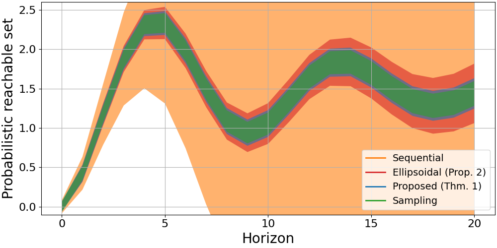

# Stochastic Data-Driven Predictive Control: Chance-Constraint Satisfaction with Identified Multi-step Predictors


[](https://opensource.org/licenses/MIT)

The code accompanying our paper that reproduces the results.

## Installation
1. Clone the main repository
2. Install the required packages
```
    pip install -r requirements.txt
```
3. Build and install this package
```
    python setup.py build install
    pip install .
```

## Reproducing Results
1. Running the following command will reproduce the Figure 1 in the paper.
```
    python scripts/fwd_reach.py
```

2. To reproduce the results for Table 1 and 2, first run the following file to estimate state-space models:
```
    python scripts/est_multi.py
```
Then, run the following file to obtain neccessary data for multi-step methods:
```
    python scripts/ctrl.py
```
Finally, run the following file to obtain necessary data for sequential method:
```
    python scripts/ctrl_d2pc.py
```

## Citation
If you use this code in your research, please cite the accompanying paper: 
Balim, H., Carron, A., Zeilinger, M. N., & Köhler, J. (2024). Stochastic Data-Driven Predictive Control: Chance-Constraint Satisfaction with Identified Multi-step Predictors.